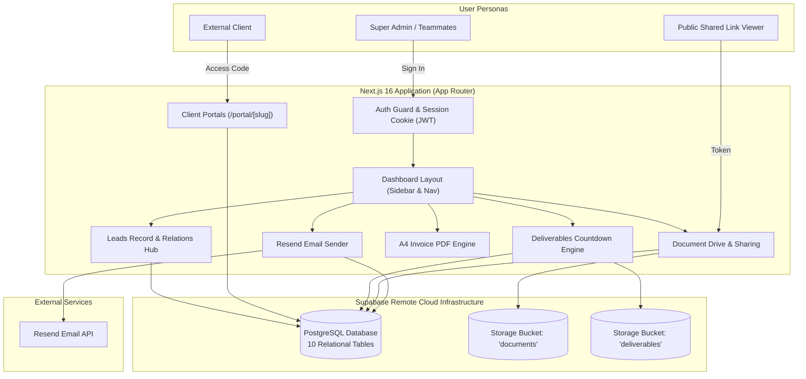

# Scalyx LeadsDigital

**Scalyx LeadsDigital** is a high-density, enterprise-grade client operations and relational leads management platform built with Next.js 16 (App Router), PostgreSQL via Supabase, and Tailwind CSS. 

Engineered specifically for digital agencies, consulting firms, and software teams, it unifies relational lead tracking, dedicated client portals, secure cloud document drives, retention-based deliverable handovers, automated Resend email dispatching, and high-precision A4 PDF invoice generation into a cohesive operational system.

---

## Table of Contents

- [Architectural Overview](#architectural-overview)
- [System Architecture & Data Flow](#system-architecture--data-flow)
- [Core Functional Modules](#core-functional-modules)
  - [1. Relational Leads Engine](#1-relational-leads-engine)
  - [2. Client Portal System](#2-client-portal-system)
  - [3. Deliverables & Auto-Deletion Engine](#3-deliverables--auto-deletion-engine)
  - [4. Documents & Recursive Drive](#4-documents--recursive-drive)
  - [5. Invoice Generator & A4 PDF Engine](#5-invoice-generator--a4-pdf-engine)
  - [6. Email Studio & Audit Logs](#6-email-studio--audit-logs)
  - [7. Projects & Milestone Tracking](#7-projects--milestone-tracking)
  - [8. RBAC & Security Matrix](#8-rbac--security-matrix)
- [Database Schema & Storage Architecture](#database-schema--storage-architecture)
- [Technology Stack](#technology-stack)
- [Environment Variables](#environment-variables)
- [Getting Started & Local Setup](#getting-started--local-setup)
- [Docker & Containerized Deployment](#docker--containerized-deployment)
- [Design Standards & Engineering Principles](#design-standards--engineering-principles)

---

## Architectural Overview

The application follows an asynchronous, stateless serverless architecture on Next.js 16 with pure remote cloud persistence:

- **Frontend**: Next.js 16 App Router with React Server Components, client-side state hydration, Base UI primitives, and Tailwind CSS v4.
- **Backend / APIs**: 17 Next.js Route Handlers delivering typed JSON responses and secure binary streams for file downloads.
- **Relational Database**: PostgreSQL hosted on Supabase, enforcing strict foreign key constraints, cascading deletions, and B-Tree indexes on relational query keys.
- **Storage Subsystem**: Supabase Storage with dedicated binary buckets (`documents` and `deliverables`).
- **Authentication**: Stateless, tamper-proof HttpOnly session cookies encoded with HMAC-SHA256 JWT tokens and salted bcrypt password hashing.

---

## System Architecture & Data Flow



---

## Core Functional Modules

### 1. Relational Leads Engine
- **Excel-Style Data Grid**: High-density table featuring horizontal X-axis scrolling (`min-w-[1150px]`) for mobile and tablet responsiveness without column clipping.
- **Multi-Dimensional Filtering**: Real-time filtering by status (`New`, `Contacted`, `Qualified`, `Proposal Sent`, `Won`, `Completed`, `Lost`), lead source, and multi-field text search.
- **Financial Metrics**: Dual-tracking of total contracted Deal Value against actual Revenue Collected with automated totals calculation.
- **Relations Hub Drawer**: Slide-over panel presenting the complete entity hierarchy attached to any given lead (linked folders, stored documents, client deliverables, running projects, and live portal status).
- **One-Click Onboarding**: Instant generation of unique client access codes with an optional checkbox to automatically dispatch branded onboarding emails via Resend.

### 2. Client Portal System
- **Public Isolated Route (`/portal/[slug]`)**: Dedicated client-facing dashboard accessed either by branded company slug or direct access code.
- **Access Verification**: Direct comparison against lead-generated portal access codes, portal slug tokens, and bcrypt password verification.
- **Live Progress Visualization**: Visual progress bar tracking project milestones from 0% to 100%.
- **Notice Board**: Pinned and chronological announcements, changelogs, and milestone releases posted by the internal team.
- **Two-Way Asset Exchange**:
  - Clients can download approved deliverables directly from their portal.
  - Clients can upload required collectible assets (logos, credentials, feedback briefs) directly to the agency's storage.

### 3. Deliverables & Auto-Deletion Engine
- **Two-Sided Classification**:
  - `deliverable_from_us`: Assets delivered by the agency to the client.
  - `collectible_from_client`: Assets provided by the client to the agency.
- **Retention Lifecycle**:
  - Tracks first download timestamp (`downloaded_at`) and cumulative download counter.
  - Automatically calculates soft-delete expiration date based on the global retention setting (e.g. 7 days).
  - Live countdown displays remaining time (`5d 14h remaining`) with dynamic updates.
  - Prevents accidental loss through admin soft-delete markers and single-click restoration.
- **Streaming Secure Downloads**: Download route (`/api/deliverables/[id]/download`) proxies binary streams from Supabase Storage and automatically updates download metrics.

### 4. Documents & Recursive Drive
- **Hierarchical Storage**: Multi-level folder organization with support for root and nested subfolders.
- **Direct Remote Upload**: Binary files stream directly to Supabase Storage bucket `documents`; file metadata and folder relationships persist in PostgreSQL.
- **Recursive Public Sharing (`/share/[token]`)**:
  - Sharing a folder generates a secure token that allows non-authenticated stakeholders to recursively browse and download all subfolders and nested files within that branch.

### 5. Invoice Generator & A4 PDF Engine
- **Live A4 Document Preview**: Pixel-accurate 210mm x 297mm preview with zoom controls (40% to 120%) and instant typography switching (Poppins, Roboto, System Font).
- **Tabular Column Alignment**: Subtotal, Tax/GST, and Total Due rows are integrated into the table's `<tfoot>`, ensuring mathematical vertical alignment with the item Cost column.
- **Vector PDF Export**: One-click download of production-quality A4 PDF documents rendered via `jsPDF` and `html-to-image`.
- **Pure A4 Print Engine**: Print stylesheet (`@media print`) isolates the `#invoice-document` element and completely suppresses sidebar navigation, headers, form controls, and backgrounds.

### 6. Email Studio & Audit Logs
- **Resend Integration**: Transactional email dispatch powered by the official Resend SDK.
- **Pre-Configured Branded Templates**:
  - Client Onboarding with portal credentials and direct link.
  - Portal Password reset and credential dispatch.
  - Deliverable Handover notice.
  - Custom Direct Email with support for multiple file attachments.
- **Persistent Audit Logging**: Every outgoing message records recipient, subject, template type, sender, timestamp, and delivery status in the `email_logs` table.

### 7. Projects & Milestone Tracking
- **Project Pipeline**: Lifecycle management tracking projects through Planning, Design, In Progress, Testing, Completed, and On Hold.
- **Relational Binding**: Explicit linking to client leads, budget allocation, currency denomination, and teammate assignment.
- **External Kanban Integration**: Dedicated external link bindings to GitHub Projects, Jira, Linear, or Trello boards.

### 8. RBAC & Security Matrix
- **Roles**:
  - `super_admin`: Full administrative control across all entities, user provisioning, global retention settings, and record deletion.
  - `teammate`: Operational access to manage leads, projects, documents, deliverables, and dispatch emails (deletion privileges restricted).
  - `viewer`: Read-only observer access.
- **Enforcement**: Centralized `hasPermission(user, resource, action)` validator enforced on every API route handler before database execution.

---

## Database Schema & Storage Architecture

### PostgreSQL Tables (Supabase)

| Table | Primary Key | Foreign Keys | Description |
| :--- | :--- | :--- | :--- |
| `users` | `id` (TEXT) | None | System operators with role and permission JSONB |
| `leads` | `id` (TEXT) | None | Core CRM client records, deal values, and portal codes |
| `folders` | `id` (TEXT) | `lead_id` -> `leads`, `parent_id` -> `folders`, `created_by` -> `users` | Drive folder hierarchy and public share tokens |
| `files` | `id` (TEXT) | `folder_id` -> `folders`, `lead_id` -> `leads`, `uploaded_by` -> `users` | File metadata, MIME types, and storage paths |
| `client_portals`| `id` (TEXT) | `lead_id` -> `leads` | Client dashboard state, progress %, and access hash |
| `portal_updates`| `id` (TEXT) | `portal_id` -> `client_portals`, `posted_by` -> `users` | Notices, milestones, and announcements |
| `deliverables` | `id` (TEXT) | `lead_id` -> `leads` | Handover assets, download counters, and soft-delete dates |
| `projects` | `id` (TEXT) | `lead_id` -> `leads` | Project milestones, budgets, and assigned teammates |
| `settings` | `key` (TEXT) | None | Global key-value configurations (e.g. retention policy) |
| `email_logs` | `id` (TEXT) | None | Outbound email audit trail with delivery statuses |

### Supabase Storage Buckets

1. **`documents`**: Publicly accessible bucket storing general drive files, project specifications, contracts, and proposals.
2. **`deliverables`**: Dedicated bucket holding client handover deliverables, code packages, and client-uploaded collectible assets.

---

## Technology Stack

- **Framework**: [Next.js 16.3.8](https://nextjs.org/) (App Router, Turbopack, React 19)
- **Runtime**: [Bun](https://bun.sh/) / Node.js
- **Database & Storage**: [Supabase](https://supabase.com/) (`@supabase/supabase-js`)
- **Styling**: [Tailwind CSS v4](https://tailwindcss.com/), `@tailwindcss/postcss`
- **Component Primitives**: [Base UI](https://base-ui.com/), [Lucide React](https://lucide.dev/)
- **Email Delivery**: [Resend](https://resend.com/)
- **Document Generation**: [jsPDF](https://github.com/parallax/jsPDF), [html-to-image](https://github.com/bubkoo/html-to-image), [JSZip](https://stuk.github.io/jszip/)
- **Authentication**: [jose](https://github.com/panva/jose) (JWT), [bcryptjs](https://github.com/dcodeIO/bcrypt.js)

---

## Environment Variables

Create a `.env.local` file in the project root with the following configuration:

```bash
# Supabase Configuration
NEXT_PUBLIC_SUPABASE_URL="https://your-project.supabase.co"
NEXT_PUBLIC_SUPABASE_ANON_KEY="your-anon-key"
NEXT_PUBLIC_SUPABASE_PUBLISHABLE_KEY="your-anon-key"
SUPABASE_SERVICE_ROLE_KEY="your-service-role-key"

# Application URL
NEXT_PUBLIC_APP_URL="http://localhost:3000"

# Authentication Session Secret (Min 32 characters)
SESSION_SECRET="your-complex-cryptographic-jwt-secret-key-32-chars-min"

# Resend Email Configuration
RESEND_API_KEY="re_your_resend_api_key"
EMAIL_FROM="Scalyx <onboarding@yourdomain.com>"

# Deliverables Default Retention (in Days)
RETENTION_DAYS="7"
```

---

## Getting Started & Local Setup

### Prerequisites

- [Bun](https://bun.sh/) (Recommended) or Node.js 20+
- A Supabase project with PostgreSQL database and storage buckets enabled

### 1. Clone the Repository

```bash
git clone https://github.com/your-org/leads-digital.git
cd leads-digital
```

### 2. Install Dependencies

```bash
bun install
# or: npm install
```

### 3. Initialize Database Schema

Execute the SQL script located in [`supabase/schema.sql`](supabase/schema.sql) in your Supabase SQL Editor to create all required tables, foreign keys, and performance indexes.

### 4. Create Storage Buckets

In your Supabase Storage dashboard, create two public buckets:
- `documents`
- `deliverables`

### 5. Run Development Server

```bash
bun run dev
# or: npm run dev
```

Open [http://localhost:3000](http://localhost:3000) in your browser.

### 6. Production Build

To verify type safety and generate an optimized production bundle:

```bash
bun run build
# or: npm run build
```

---

## Docker & Containerized Deployment

A production-ready multi-stage `Dockerfile` and `docker-compose.yml` are included for self-hosted container deployments:

### Run via Docker Compose

```bash
docker compose up -d --build
```

The application will be compiled and exposed at `http://localhost:3000`.

---

## Design Standards & Engineering Principles

1. **Sharp Aesthetic Standard**: No rounded corners (`rounded-none`, `border-radius: 0px !important`). All cards, buttons, inputs, tabs, and modals adhere strictly to sharp geometric lines.
2. **Professional Iconography**: Zero emojis across the entire codebase, user interface, and email templates. Clean, functional Lucide SVG icons are used exclusively.
3. **Pure Cloud Persistence**: Zero local file writing, zero JSON mock stores, and zero ephemeral local disks. All data lives in remote Supabase PostgreSQL and Storage buckets.
4. **Defensive Data Integrity**: Strict foreign key compliance; optional uploader and creator fields fall back gracefully to `NULL` to prevent constraint violations.
5. **Print & Export Fidelity**: Invoices and reports print exclusively as clean A4 documents, suppressing all surrounding application UI.

---

## License

Proprietary software engineered for Scalyx Digital Systems. All rights reserved.
